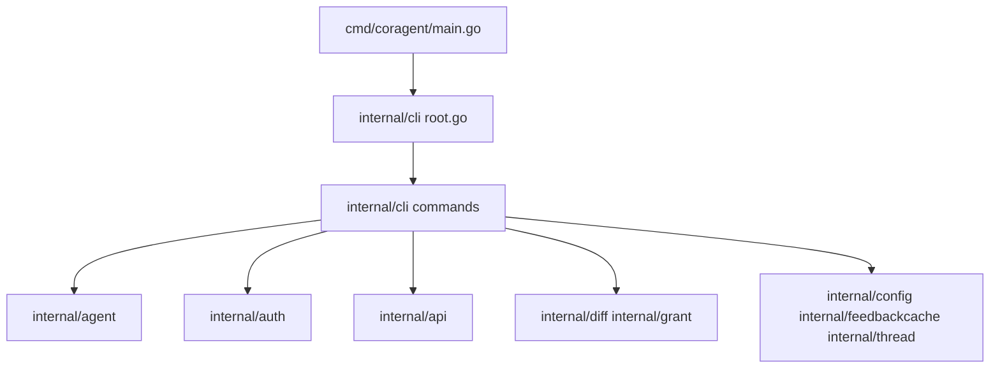

# Architecture Overview

## Entry Point

The CLI starts at `cmd/coragent/main.go`, which calls `cli.Execute()`.

```go
func main() {
    cli.Execute()
}
```

## Package Layout



## Layer Responsibilities

| Layer | Package | Responsibility |
|-------|---------|-----------------|
| Entry | `cmd/coragent` | Bootstrap; delegates to `cli.Execute()` |
| CLI | `internal/cli` | Cobra commands, flags, target resolution, client construction |
| Agent | `internal/agent` | YAML parsing, vars/env substitution, spec validation |
| Auth | `internal/auth` | Config loading, JWT/OAuth, token store |
| API | `internal/api` | HTTP client, Snowflake REST API, service interfaces |
| Diff | `internal/diff` | Spec diff (desired vs remote) |
| Grant | `internal/grant` | Grant/revoke diff and execution |
| Config | `internal/config` | `.coragent.toml` project settings |
| FeedbackCache | `internal/feedbackcache` | Local feedback cache (`~/.coragent/feedback/`) |
| Thread | `internal/thread` | Thread state store for `run` and `threads` |

## Key Interfaces

The API layer exposes service interfaces (defined in `internal/api/interfaces.go`) used by plan/apply and tests:

- `AgentService` — Create, Update, Delete, Get, Describe, List agents
- `RunService` — RunAgent (streaming)
- `ThreadService` — Create, List, Get, Delete threads
- `GrantService` — ShowGrants, ExecuteGrant, ExecuteRevoke
- `QueryService` — GetFeedback, CortexComplete (SQL)

`*api.Client` implements all five interfaces (compile-time assertions enforce this). The client also has feedback-table helper methods (`FeedbackTableExists`, `SyncFeedbackFromEventsToTable`, etc.) that are not part of any interface. See [components/api.md](../components/api.md) for details.

## Data Flow (Plan/Apply)

1. **Load** — `agent.LoadAgents(path, recursive, env)` parses YAML and resolves vars
2. **Resolve** — `ResolveTarget(spec, opts, cfg)` yields database/schema per spec
3. **Build plan** — `buildPlanItems` fetches remote state, computes diff and grant diff
4. **Apply** — `executeApply` creates/updates agents and applies grant diff

See [flows/plan-apply-flow.md](../flows/plan-apply-flow.md) for the full lifecycle.
