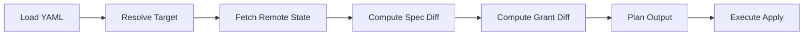

# Plan/Apply Flow

The plan and apply commands share the same core logic: load specs, resolve targets, compute diffs, and (for apply) execute changes.

## Lifecycle

## Steps

### 1. Load

- **Function:** `agent.LoadAgents(path, recursive, envName)`
- **Source:** `internal/agent/loader.go`
- **Behavior:** Reads YAML files (single file or directory), parses vars, substitutes `${ vars.* }` and `${ env.* }`, resolves `deploy.grant.envs` into a flat grant config, validates spec
- **Output:** `[]agent.ParsedAgent` (path + spec per file)

### 2. Resolve Target

- **Function:** `ResolveTarget(spec, opts, cfg)`
- **Source:** `internal/cli/resolve.go`
- **Behavior:** Resolves database and schema from (in order): CLI flags, `deploy.database`/`deploy.schema` in spec, auth config
- **Output:** `Target{Database, Schema}`

### 3. Build Plan Items

- **Function:** `buildPlanItems(ctx, specs, opts, cfg, agentSvc, grantSvc)`
- **Source:** `internal/cli/plan_core.go`
- **Behavior:**
  - For each spec: resolve target, call `agentSvc.GetAgent` to get remote state
  - If not exists: compute grant diff vs empty; plan create
  - If exists and `deploy.grant` is specified: call `grantSvc.ShowGrants`, compute grant diff; call `diff.Diff(spec, remote)` for spec changes
  - If exists and `deploy.grant` is not specified: skip grant logic (no ShowGrants, empty grant diff)
  - The CLI passes a command-scoped context so SQL calls are tagged as `coragent:plan` or `coragent:apply` by default
- **Output:** `[]applyItem` (parsed, target, exists, changes, grantDiff)

### 4. Plan Output

- **Plan:** Prints only agents that will be created or updated, with diff details and grant changes; unchanged agents are omitted from the detailed body and counted only in the summary
- **Apply:** Uses the same preview output as `plan`, then confirmation prompt (unless `-y`), then `executeApply`
- **Value rendering:** String diff values are printed in full (quoted for readability) and are not truncated, so long values and multibyte text such as Japanese remain intact in plan/apply/delete previews
- **Modified rendering:** Updated values use a colored arrow between before/after values to make replacements easier to scan in the CLI output

### 5. Execute Apply

- **Function:** `executeApply(ctx, items, agentSvc, grantSvc)`
- **Source:** `internal/cli/apply_core.go`
- **Behavior:**
  - For each item:
    - If not exists: `CreateAgent`, optional post-create update for `tool_resources`, `applyGrantDiff`
    - If exists and has spec changes: `UpdateAgent` with payload from `updatePayload(spec, changes)`
    - Always: `applyGrantDiff` (GRANT/REVOKE as needed; no-op when grant diff is empty, e.g. when `deploy.grant` was not specified)
  - Any SQL executed during apply inherits the `apply` query tag context
- **Output:** Subset of items that were created or updated

## Grant Diff

- **Package:** `internal/grant`
- **Logic:** `grant.FromGrantConfig(spec.Deploy.Grant)` → desired; `grant.FromShowGrantsRows(rows)` → current; `grant.ComputeDiff(desired, current)` → `GrantDiff{ToGrant, ToRevoke}`
- **Execution:** `applyGrantDiff` runs REVOKE first, then GRANT

## Related Docs

- [components/agent.md](../components/agent.md) — Load and vars
- [components/diff-and-grant.md](../components/diff-and-grant.md) — Diff and grant details
- [components/api.md](../components/api.md) — AgentService, GrantService
